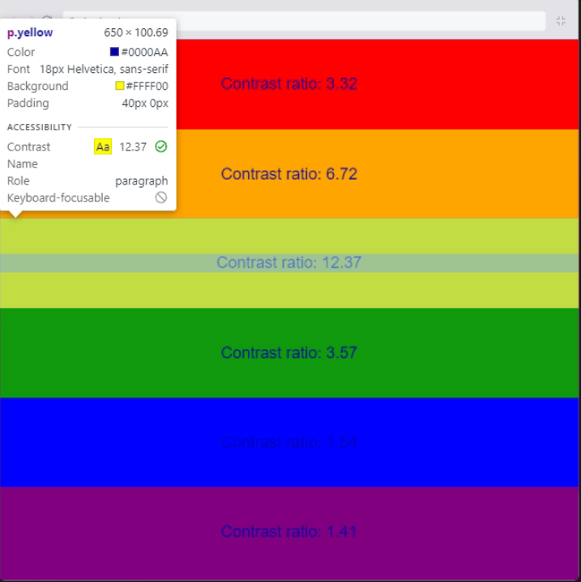

# Accessible Development

A content is considered accessible as soon as it turns available, and its functionality can be operated, by literally *anyone*. Therefore, accessible development means to develop with everyone in mind, including all the users who have some sort of disability.

Developing accessibly ins't just the right thing to do, but any future employer will want to know that you have all their users in mind when making decisions, and is also the law (in some countries).

## Table of contents

- [Understanding web accessibility](#understanding-web-accessibility)
- [Accessibility tree](#accessibility-tree)
- [Enabling accessibility tree on browser](#enabling-accessibility-tree-on-browser)
- [Accessibility testing](#accessibility-testing)
- [Accessibility guidelines](#accessibility-guidelines)
- [Color contrast for text](#color-contrast-for-text)
- [Alternative text](#alternative-text)
- [Accessible links](#accessible-links)
- [Accessible forms](#accessible-forms)
- [Semantic HTML](#semantic-html)
- [Text-size](#text-size)
- [Headings](#headings)
- [ARIA](#aria)
- [Accessible JavaScript](#accessible-javascript)
- [Accessible CSS](#accessible-css)

## Understanding web accessibility

There are various types of assistive technologies (**ATs**) that benefit from accessible web content. These include, but are not limited to:

- Screen readers
- Speech recognition systems
- Screen magnifiers
- Alternative input devices for people with motor skill limits

Screen readers are the most common types, and they rely heavily on headings, links, and form labels for navigation.

### Accessibility tree

At the heart of web accessibility is the accessibility tree, a key part of how browsers interact with assistive technologies. This tree is a simplified representation of the webpage focusing on elements important for accessibility, such as headings, links, and form labels.

```html
<div>
    
</div>
```

The code snippet above shows a simple example of an accessibility tree. The browser translates that into a visual UI. But at the same time, it also translates our code into an object called the accessibility tree, which contains a lot of important information and context int text form.

```html
<button type="button">Click me</button>
<div>Click me</div>
```

The code snippet above shows two buttons that look the same in the visual UI if we style them accordingly. But in the accessibility tree, the button made using a `<div>` tag lacks information and context.

When you use semantic HTML, that is the right element for the right purpose, the browser automatically feeds the correct information into the accessibility tree. This helps assistive technologies to navigate and interpret the context accurately.

Keyboard accessibility is another cornerstones of web accessibility, by using correct HTML elements, like the `<button>` tag or the `<a>` tag or form controls, you get keyboard accessibility for free. This means these elements are naturally focusable and operable with a keyboard, no extra coding required.

### Enabling accessibility tree on browser

On your browser, open the developer tools and go to the **Accessibility** tab. Once there, mark the **Enable accessibility tree** checkbox and reopen the developer tools. After that you will see the accessibility button in the top right corner. Once you click on it, the accessibility tree will be displayed.

### Accessibility testing

So how do we test our accessibility? Well the first way is quite straightforward, we can experience our own site using, for example, a screen reader to understand how our content is presented (or other assistive technologies). There are also tools like:

- Contrast checkers that help ensure our text is readable against its background
- Automated tools
    - LightHouse
    - Accessibility inspector
    - aXe
- AI assistants

## Accessibility guidelines

Before we start, we need to know what is considered accessible. There are well-defined requirements on things like text, images, the HTML code, and so on. These are called the web content accessibility guidelines (**WCAG 2.0**).

These guidelines have different levels called `A`, `AA`, `AAA`. The `A` level means it's not accessible. The `AA` is considered accessible. But what we really want to achieve is the highest grade `AAA`, whenever possible.

### Color contrast for text

Our first contrast example will be color contrast for text as in the contrast that text has against its background.

Black text against black background has a contrast ratio value of **1:1**, it's the same color. The highest contrast ratio is black and white, that has a contrast ratio value of **21:1**.



To be accessible normal text should at least have the value of **4.5** and at least **3.0** for large text (>= 24px). But what we really want to achieve are these `AAA` requirements, **7:1** for normal text and **4.5** for large text (>= 24px).

While colors are a super way to communicate information, we should not rely solely on color. Instead, we should combine color with shapes or with text, or ideally, both.

### Alternative text

When we add images to a web page, we should consider the fact that some users cannot see images. They need a text alternative, and as we will see, this text is simply added inside the HTML tags. That text is not visually displayed on the page, but is hidden in the code to be accessed by screen readers and search engines like Google.

So what is best practices when writing alternative text for images? Clear, concise alt text is the best. We also shouldn't start by writing - "An image of ..." - because a screen reader will say it's an image anyway.

In case you are wondering if we should add an alternative text to all images, the answer is - **it depends**. We should add the `alt` attribute to all images in our HTML. But if the image is purely decorative, we don't need to write any descriptive text as the value for that attribute, in other words, we can leave it empty because without it, a screen reader may read out the image file name instead, and that can be quite annoying.

Alternative text mainly help those little or no vision, those who have turned off images to save data, and it also helps search engines find appropriate content. By ending your alternative texts with a period makes the screen reader do a brief pause, which can be helpful when listening to it describe all the content on a page.

Reinforcing, not all images should have an alternative text, such as purely decorative images. They don't add informational content, but are purely for aesthetics. Examples include stylistic flourishes, background images, or images used for spacing. Another very common type of decorative image that should have an empty `alt` attribute are icons combined with text. Things, for example, of the magnifying glass in a search field.

This is a reason why it's preferable to add any decorative background images using CSS instead of an HTML image element, because we don't need to describe it with an alternative text.

Also, if the image, for example, has a label or an adherent text that describes the image, an alternative text also becomes redundant.

### Accessible links

Labels for control elements, like buttons are very useful to all users, but getting them right is particularly important to users with disabilities. For links, you should use the `<a>` tag in your HTML, make them properly recognizable as links and easy to find, and they should have non-ambiguous text. By that I want to emphasize that anyone should be able to understand where the link will take them, even out of context the links are in. So don't just use terms like "click here", "continue", or "more" that can be easily misinterpreted.

Avoiding using HTML anchor tag to wrap a whole section of elements. There are CSS and JavaScript solutions to make an element clickable. The anchor tag should wrap only the necessary elements. When doing that, ensure the element is focusable and change the pointer to easily denote that the element is clickable.

### Accessible forms

#### Accessible labels

Input fields must have both, labels and placeholders. When using labels you can associate them with the input fields using the `for` attribute matching the `id` attribute of the input field, by doing that, when the user clicks on the label, the input field will be focused.

For buttons and radio buttons, the text already acts as a label.

#### Accessible radio buttons

By using the `fieldset` element you can group related radio buttons together. You can also use the `legend` element to add a title for the group.

### Semantic HTML

For better defining the structure of your web page, you should use semantic HTML. This means that you should use the correct HTML element for the correct purpose.

Instead of a bunch of nesting `<div>` tags, you should use `<header>`, `<main>`, `<nav>`, `<section>`, `<article>`, `<aside>`, `<footer>`, `ul` and `li` tags.

### Text-size

The pixel unit (px) is an absolute measurement, so when defining text-size in pixels the font will be displayed the same regardless the screen size. So is better to use relative measures like `rem` units.

- 1rem = 16px.
- 1.5rem = 24px.
- 2rem = 32px.

### Headings

Screen reader users mainly navigate websites using headings, so it's important to use headings correctly.

Heading numbers should be consecutive, a page should contain only one `h1` tag, they should be applied for structure and not for styling.

### ARIA

ARIA stands for *Accessible Rich Internet Applications*, is a set of attributes that you can add to HTML elements to provide more context and information to assistive technologies. It helps fill in the gaps where HTML's native semantics fall short.

The first rule of ARIA is to use the right role for the right element. And the second is to use the right ARIA attribute for the right element. Try to stick to native semantics when possible.

### Accessible JavaScript

The usage of events like `mouseover` and `mouseout` are not accessible for users interacting with the page using a screen reader, or a touchscreen. Events that rely only on mouse interactions can exclude users who navigate using keyboards or touchscreens. Instead of mouse-only events, we should consider using more inclusive event handlers, for instance, click events are generally accessible to mouse, keyboard, and touchscreen users. Similarly, `focus` and `blur` can effectively replace `mouseover` and `mouseout` events, also there is a `touchstart` event, but often standard click events are sufficiently as they are automatically mapped to touch interactions in most environments.

### Accessible CSS

There are various reasons you might want to hide content from sighted users while keeping it accessible for people who use assistive technologies. This includes managing complex layouts like tab interfaces, menus, sidebars, or modal dialogues, where visual clutter can be minimized without sacrificing accessibility.

The problem is that using CSS properties like `display: none` or `visibility: hidden` to hide content will also hide it from screen readers, because by doing so we completely remove those elements from the accessibility tree. So consider using techniques that visually hide content but keep it in the accessibility tree, one common method is to position the content off-screen using CSS, or making it invisible with the `opacity: 0` property. And be very rigorous about using modals, ask yourself if the element really need to be a modal.