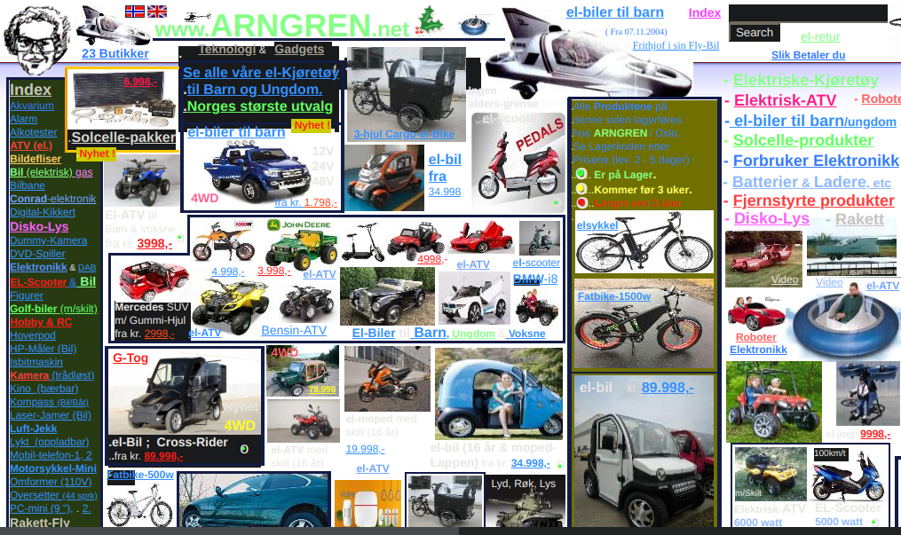

# Design fundamentals

## Shape and space

We can separate the forms into 2 sets of __geometric__ and __organic__. Geometric forms have angular and artificial characteristics, as they were created by us and are not found in nature. Organic forms are noticeably more curvy and have gestural characteristics.

Let's see now a example about how to work with shapes on the web.

In the image above, we can see the use of geometric shapes to compose a website. It uses a rectangle to create the *Add to cart* button, there are also two nearby squares that communicate with this rectangle, the horizontal lines also communicate with these elements. The product is highlighted by the use of a circle behind it, the typography is also geometric, we can see this in the intense use of straight lines. It is a whole composition based on geometric shapes, and each element is communicating with the other.

Try to identify other elements and how they communicate in the next two examples.

On a good website all the elements are necessary and communicate with each other.

Now let's start seeing the use of organic shapes. Our first example is taken from the [WWF flamingo's support website](www.pablotheflamingo.com).

Can you see the abuse of curves in the main elements presented on the site? Despite using circles in the icons, it is the most curved geometric shape there is.

> "Space is defined and acquires meaning at the instant a shape appears within it."

Given that definition, let's move into our next example.

See how there's a huge blank space designed to focus on the elements that are really needed?

Now let's compare our previous example to the next one.

There is no hierarchy in the elements, since each one aims to stand out more than the other, this results in a visual disorganization.

I will refer to this [Medium article](https://medium.com/@chrsdesigns/composition-in-design-86267fc2fca) where it approachs about composition in design.

And there is one more regarding to negative spaces from [Team Treehouse](https://blog.teamtreehouse.com/white-space-in-web-design-what-it-is-and-why-you-should-use-it).
