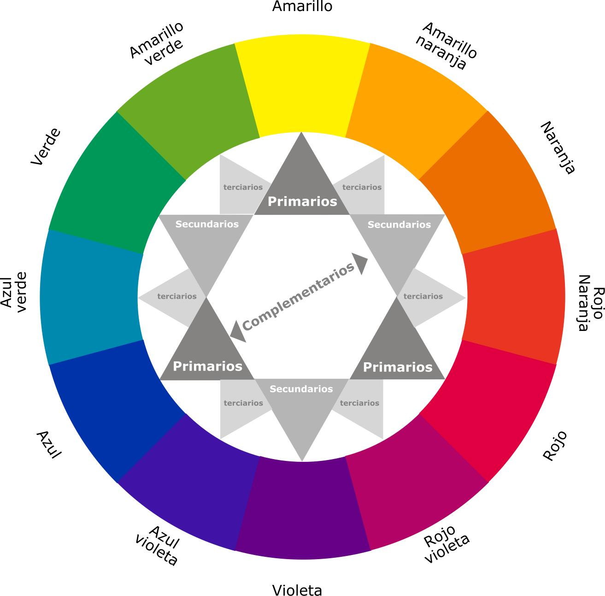
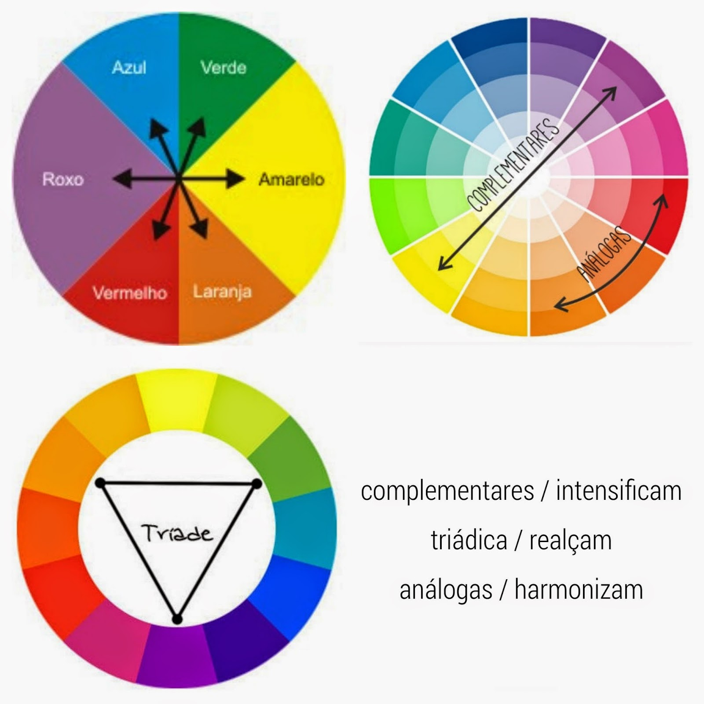
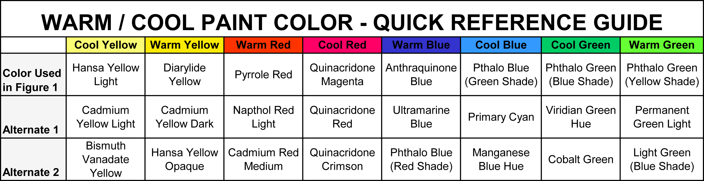

# Design theory

## Design fundamentals

### Colors

> "There are few visual stimuli as powerful as color; it is a profoundly useful communication tool." - Timothy Samara

The use of the color palette can be an advantage or a sabotage.

> “In fact, we work with few colors. What gives the illusion of their number is that they were put in the right place.” Pablo Picasso

Albert Henry Munsell contributed a lot for the color theory and created the Munsell color system based on: Hue, Lightness and Chroma.

Dealing with colors may seem complex, but in reality, it only requires that we know how to perceive them to the point of identifying whether there is a conflict (close colors) or a contrast (color clash), so that they can be applied in a harmonious way.

The whole idea is based on the way that the human visual system works, so there are three main colors called __primary__: Red, Yellow and Blue.

The combination of primary colors results in another variation called __secondary__, composed of: Green (yellow-blue), Orange (yellow-red) and Purple (red-blue).

The mix of secondary colors gives rise to a futher variation called __tertiary__, made up by: Amber (yellow-orange), Vermilion (red-orange), Magenta (red-purple), Violet (blue-purple), Teal (blue-green) and Chartreuse (yellow-green). But if you search you will be able to [discover others groups](https://en.wikipedia.org/wiki/Tertiary_color#Tertiary-_and_quaternary-color_terms).

From the Hue Wheel we can organize different __color schemes__: Analogous, Complementary, Triadic, Cool and Warm.

Analogous colors have the same base color and are positioned side by side on the wheel. Even so, there is a slight distinction between them, capable of differentiating them. They allow us to create calm environments and monochromatic decorations, that is, those in which a single tone is predominant. Therefore, the colors considered analogous to each other are composed of an identical primary color. Through analogous colors you will be able to promote sensations such as serenity and balance, since human beings usually like tones found in nature, which are similar to each other and end up transmitting peace and harmony. Combining similar colors, however, is more complex than it might seem at first. It is necessary to choose shades that, although similar, have enough contrast to differentiate them. To build harmonic designs at the visual level using analogous colors, it is important that you choose a medium color to be used as the predominant one. Make sure you have enough contrast when choosing an analogous color scheme. Choose one color to dominate, a second to support. The third color is used (along with black, white or gray) as an accent.

Complementary colors are those that are located at the opposite end of the wheel so they complement each other. In this way, the complementary color of a primary color will always be a secondary color, and vice versa. A pair of complementary colors is made up of one cool color and one warm color. This helps create what is known as simultaneous contrast, the highest contrasts available on the color wheel. Simultaneous contrast occurs due to a natural illusion when you place two complementary colors next to one another. Both colors will appear brighter and grab a viewer's attention. Complementary colors are really bad for text.

A triadic color scheme uses colors that are evenly spaced around the color wheel. They tend to be quite vibrant, even if you use pale or unsaturated versions of their hues. To use a triadic harmony successfully, the colors should be carefully balanced - let one color dominate and use the two others for accent.

Warm colors advance and cool colors recede, affecting the perception of depth. This theory is based upon that fact that the eye adjusts when focusing on colors of different wavelengths. Red light waves have a longer wavelength than blue ones. An image containing both cool and warm colors would demonstrate contrast of temperature or warm/cool contrast creating more complex relationships between the color (warm colors can read cooler against a higher intensity warm colors and cool colors sometimes can advance against predominately warm palette). Gray and brown aren’t on most color wheels, but they’re considered neutral because they don’t contrast with much of anything. They’re dull and uneventful. However, drop a little color in a headline and it will sing. It is important to remember that its use, as well as its effect, will always be influenced by the amount of light. Just as although the meaning of colors exists and is proven, their perception is always associated with a context. Yin and Yang okay.

Na psicologia das cores, as cores frias transmitem sensações de frio, tranquilidade e conforto. As cores frias também costumam ser associadas com o amanhecer, a noite e elementos como a água ou o gelo.

Check out others variances of color harmonies [here](https://www.tigercolor.com/color-lab/color-theory/color-harmonies.htm)

The Adobe provides a web tool, so you can mix and create different colors schemes. Once there you can change the color mode and get the respective hexadecimal code. Available [here](https://color.adobe.com/create/color-wheel).

> “If one says “Red” - the name of the color - and there are fifty people listening, it can be expected that there will be fifty reds in their minds. And one can be sure that all these reds will be very different.” - Josef Albers, Interaction of Color (1963)

You should keep in mind that the color names are relative, my blue may be your aqua green. Also, what color psychology says depends a lot on people's culture, so be skeptical about it.

Websites to get inspiration for color schemes: [Dribbble](https://dribbble.com/), [Design-seeds](https://www.design-seeds.com/).
